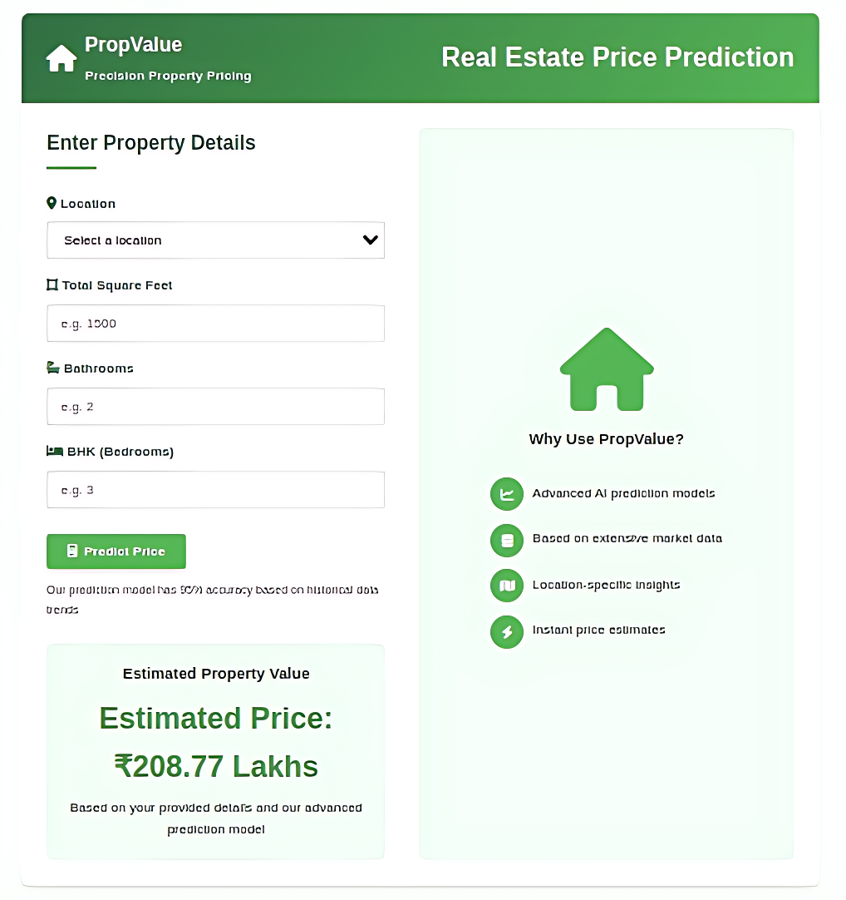

# Real Estate Price Predictor



## 📌 About the Project
This project predicts real estate prices based on various features like **location, BHK, square footage, and bathrooms**.  
It uses a **machine learning model** trained on Bangalore house price data and is deployed using **Flask** on **Render**.

## ✨ Features
- 🏠 **Predicts house prices** based on user inputs.
- 🎯 **Uses a trained ML model** to provide accurate results.
- 🌐 **Flask-based web interface** for easy interaction.
- 🚀 **Deployed on Render** for online access.

## 🛠️ Tech Stack
- **Frontend:** HTML, CSS  
- **Backend:** Flask (Python)  
- **Machine Learning:** Scikit-learn, NumPy, Pandas  
- **Deployment:** Render  

## 🔧 Installation & Setup
1. Clone the repository:
   ```sh
   git clone https://github.com/MANJU-BHARGAV/real-estate-predictor.git
   ```
2. Navigate to the project folder:
   ```sh
   cd real-estate-predictor
   ```
3. Install dependencies:
   ```sh
   pip install -r requirements.txt
   ```
4. Run the application:
   ```sh
   python app.py
   ```
5. Open in browser:
   ```
   http://127.0.0.1:5000/
   ```

## 🌍 Live Demo
Check out the **live version** of the project:  
🔗 [Real Estate Price Predictor](https://real-estate-predictor-9flu.onrender.com)

## 🏗️ Future Improvements
- 📈 Improve model accuracy with more training data.
- 🎨 Enhance UI/UX with better design.
- 🔗 Allow API integration for wider use.

---

### 📩 Contact
For any queries or suggestions, feel free to reach out:  
📧 **Email:** manjubhargavramisetty@gmail.com  
📞 **Phone:** 9989768566  

🚀 **Happy Coding!**
